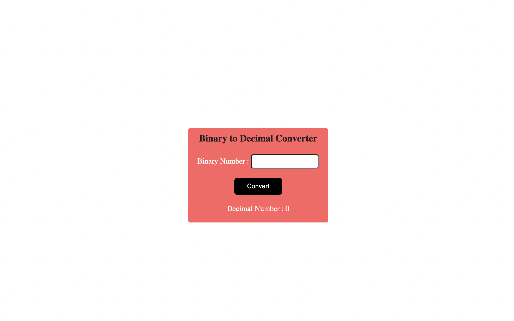
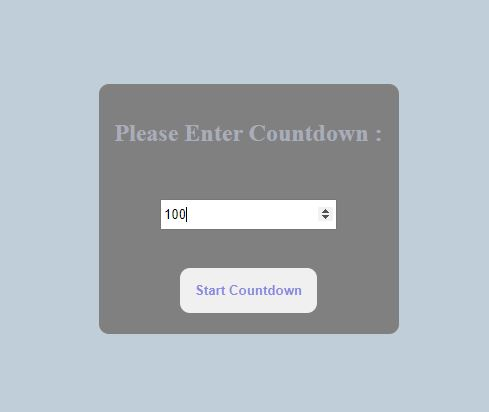
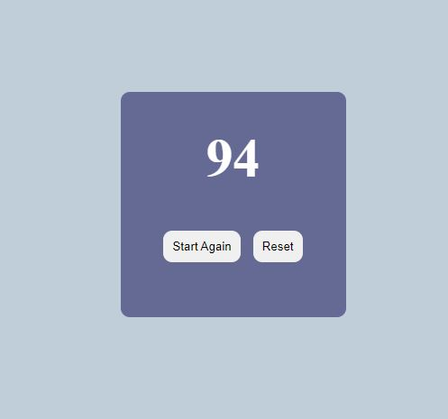
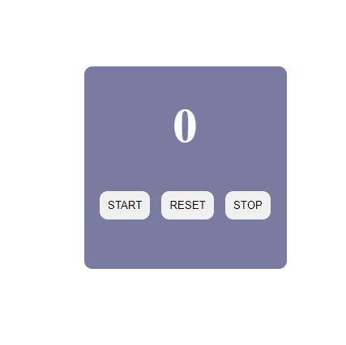
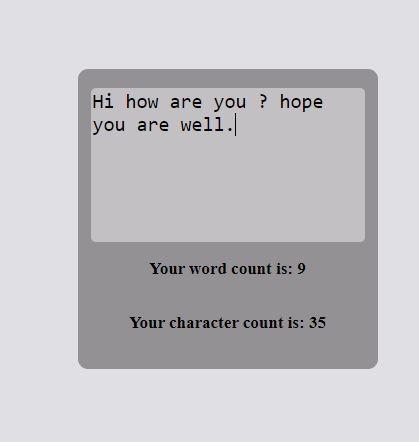

# Fun With JavaScript

## **Accordian** :
 

 ## **Age-Calculator**
 

 ## **Basic Counter**
 

 ## **Binary to Decimal**
 

 ## **Calculator**
 

 ## **Click the Button**
 

 ## **Color Changer**
 

 ## **JS Quiz App**
 

 ## **Name Conversion**
 

 ## **Password Generator**
 

 ## **Aee What You Type**
 

 ## **Todo App**
 

 ## **Countdown**
 
 

 ## **Expense Tracker**
  
  
  

 ## **Form validation**
   

 ## **Memory Card Game**
   

 ## **Palindrome Checker**
   
   

 ## **Stopwatch**
 

 ## **Typing Game**
  
  

 ## **Word Count**
   